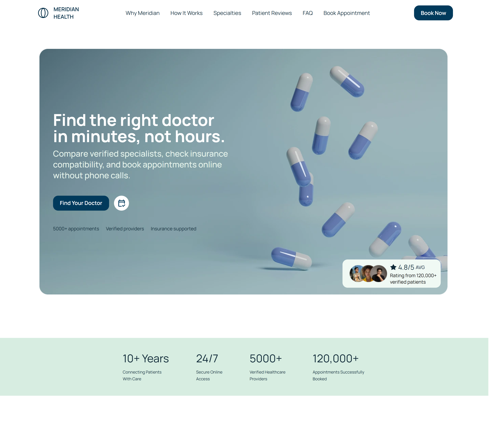

# Meridian Health

**A healthcare booking experience designed to turn patient intent into action.**

A responsive healthcare landing page created with a conversion-focused approach — using trust signals, verified providers, simple booking steps, and minimal visual noise to guide visitors toward becoming booking users.

**Live Website:** [meridian-healthcare.vercel.app](https://meridian-healthcare.vercel.app/)



---

## Overview

Meridian Health is a **responsive healthcare landing page concept** built around a simple objective:

> **Turn “I should see a doctor” into “I have an appointment.”**

The experience is designed to reduce hesitation and cognitive load throughout the patient's journey. Instead of overwhelming users with information, the interface uses **clear hierarchy, concise content, trust signals, verified providers, and straightforward booking steps** to move users toward action.

The design focuses on answering the questions a potential patient needs answered before booking:

* Can I trust this service?
* Are the providers verified?
* How does booking work?
* Can I find care quickly?
* What should I expect?

Every section contributes to that journey rather than existing purely as visual content.

---

## Features

* 🎯 Conversion-focused healthcare landing page
* 🩺 Verified provider discovery
* 📅 Clear appointment and booking CTAs
* ⚡ Same-day care messaging
* 🔐 Trust and privacy signals
* ⭐ Patient testimonials and social proof
* 🧭 Three-step care discovery journey
* 💬 FAQ accordion
* 📱 Responsive navigation
* 🖥️ Desktop, tablet, and mobile layouts
* ✨ Scroll-based animations and micro-interactions
* 🖼️ Optimized WebP imagery
* ♿ Accessibility-conscious interface

---

## Design

Meridian Health was designed around one principle:

> **Make choosing healthcare feel simple and trustworthy.**

The visual system deliberately avoids excessive decoration and long blocks of copy. Instead, the interface relies on hierarchy, spacing, typography, imagery, and carefully placed trust signals.

### Design Principles

**Trust**
Verified providers, patient testimonials, security messaging, and clear information establish credibility before asking users to book.

**Clarity**
Content is intentionally concise, with each section communicating one primary idea.

**Low Cognitive Load**
The interface avoids unnecessary choices and keeps the primary booking journey visually obvious.

**Conversion**
Calls to action are consistently positioned around moments where users have enough context to take the next step.

**Accessibility**
Readable typography, strong contrast, semantic structure, responsive layouts, and clear interaction states support a wider range of users.

### Visual Direction

The visual language combines:

* Deep healthcare-oriented blues
* Muted teal accents
* Soft neutral surfaces
* Generous whitespace
* Strong typographic hierarchy
* Restrained rounded components
* Human-centered healthcare imagery

---

## Tech Stack

### Frontend

* **React**
* **TypeScript**
* **Vite**
* **Tailwind CSS**

### Animation

* **GSAP**
* **ScrollTrigger**
* **@gsap/react**

### Icons

* **Lucide React**

### Deployment

* **Vercel**

---

## Development

The project was developed as a component-based React application with a focus on maintainability, responsive behavior, animation performance, and reusable UI patterns.

The implementation separates major page sections and reusable interface components rather than treating the landing page as a single large component.

### Development Focus

* Component-based architecture
* Responsive-first implementation
* Reusable UI patterns
* Type-safe React development
* Controlled GSAP animations
* Optimized image assets
* Semantic HTML structure
* Production-oriented Vite configuration

---

## Project Structure

```text
meridian/
├── docs/
│   └── screenshots/
│       └── desktop.png
│
├── src/
│   ├── assets/
│   ├── components/
│   ├── sections/
│   ├── App.css
│   ├── App.tsx
│   ├── index.css
│   └── main.tsx
|
├── index.html
├── package.json
├── tsconfig.json
├── vite.config.ts
└── README.md
```

---

## Getting Started

### 1. Clone the repository

```bash
git clone https://github.com/ysdesilva21/meridian-healthcare.git
cd meridian-health
```

### 2. Install dependencies

```bash
npm install
```

### 3. Start the development server

```bash
npm run dev
```

Vite will provide the local development URL in your terminal.

---

## Production Build

Create an optimized production build:

```bash
npm run build
```

Preview the production build locally:

```bash
npm run preview
```

---

## Responsive Design

Meridian Health was designed to provide a consistent experience across:

* Desktop
* Tablet
* Mobile

Responsive behavior was considered across:

* Navigation
* Typography
* Section spacing
* Provider cards
* Appointment UI
* Images
* CTAs
* FAQ interactions
* Footer layout

The goal was not simply to shrink the desktop layout, but to preserve the **booking journey and visual hierarchy** at every viewport size.

---

## Performance & Accessibility

Performance and accessibility were considered throughout development.

### Performance

* WebP image assets
* Responsive image sizing
* Component-based rendering
* Vite production builds
* Controlled GSAP animations
* Reduced unnecessary animation work

### Accessibility

* Semantic HTML
* Strong color contrast
* Readable typography
* Clear interactive states
* Responsive layouts
* Reduced visual complexity


---

## Credits

Meridian Health is an original frontend and product design project by **Sanju De Silva**.

Third-party resources such as photography, illustrations, icons, fonts, and mockups may be sourced from external providers. Those assets remain subject to their respective licenses and terms.

* **Icons:** Lucide React
* **Images / Visual Assets:** Third-party assets used under their respective licenses (Pexels, Pixabay, Unsplash)

---

## License

The source code and original interface implementation are provided for **portfolio and educational purposes**.

You may reference the implementation and structure for learning, but the original Meridian Health branding, visual design, content, and project assets should not be redistributed or presented as your own work.

Third-party assets included in the project remain subject to their original licenses.

---

## Author

**Sanju De Silva**

Frontend Developer & UI/UX Designer

**React · TypeScript · Tailwind CSS · GSAP**

[GitHub](https://github.com/ysdesilva21)
